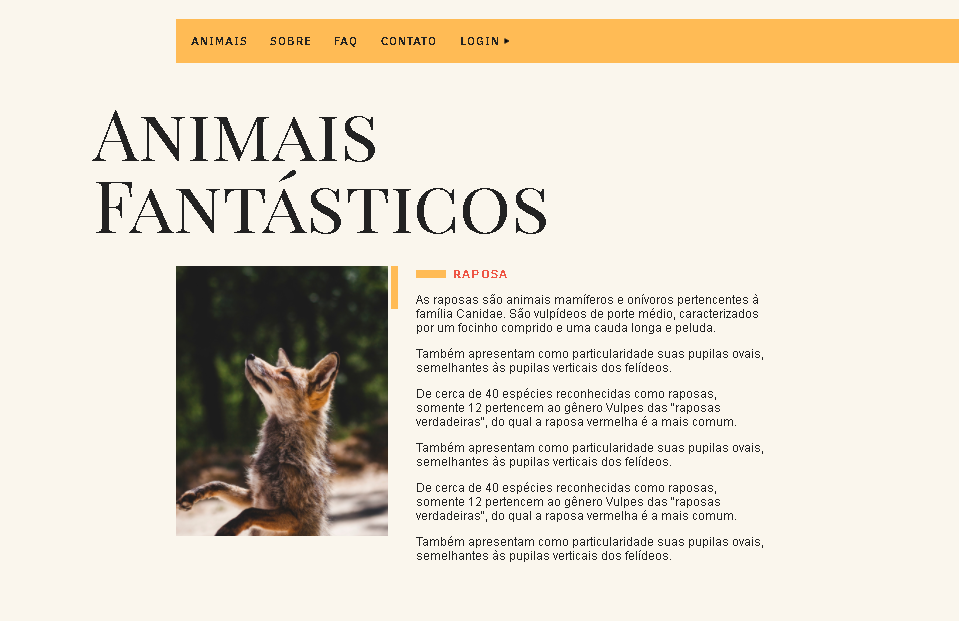

# AnimaisFantasticos

  

Projeto feito para práticar e aprender JavaScript no curso de JavaScript ES6 da Origamid.

Nesse projeto eu consegui aprender muitas coisas, pois nele foi desenvolvido animações ao click, ao scroll, mouseover, um slide do zero aonde eu consegui ver muitos eventos, funções e propriedades, uso de uma API, refatoração do código, uso do git e diversas outras coisas!

### Tecnologias usadas:
- HTML
- CSS
- JavaScript ES6
- babel
- webpack
- git
- api
- OOP
